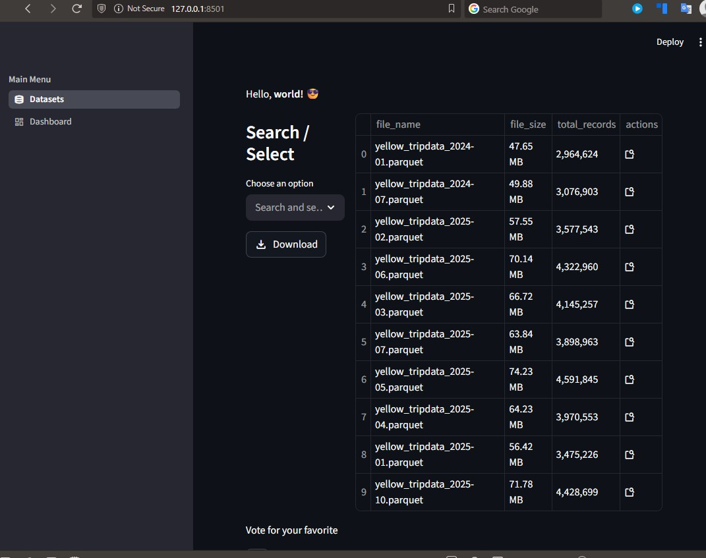

# Newyork Taxi Analystics Dashboard

_THE PORJECT IS STILL UNDER DEVELOPMENT_

DOCKER ENVIRONMENT

 

For this portfolio project, we use:

- **Parquet:** raw and staged storage

- **Apache Spark/ Pyspark:** ETL and parallel transforms. Parallel ingest, schema cleanup, feature engineering, partitioned stage writes, and aggregate preparation.

- **PyIceberg:** curated local table layer. Curated fact and aggregate tables, snapshot history, partition-aware table management.

- **DuckDB:** fast SQL for analytics and dashboard queries. Fast SQL for charts, filters, previews, and developer exploration. Its Iceberg extension supports reading Iceberg tables, and with a REST catalog it also supports write operations.

- **Streamlit:** Multipage UI, filters, KPI cards, charts, tables, and admin controls.

- **Docker Compose:** Reproducible local environment with one service for the Streamlit app and one for the ETL runner, sharing the same mounted data volume. Compose is meant for defining and running multi-container applications and lets teammates start the stack with a single command.

[//]: # (### Best local Iceberg setup for this portfolio)

[//]: # ()
[//]: # (Use PyIceberg with a local filesystem warehouse and SQLite-backed SQL catalog. PyIceberg’s docs explicitly present this as a demo/playground-friendly local setup and note it is not meant as a production-scale configuration. PyIceberg also supports appending and overwriting table data.)

[//]: # ()
[//]: # (Best first implementation order)

[//]: # ()
[//]: # (**Start small:**)

[//]: # (1. Load 1–3 months of taxi data )

[//]: # (2. Build Dask cleaning + feature engineering )

[//]: # (3. Save cleaned stage Parquet )

[//]: # (4. Create one Iceberg fact table )

[//]: # (5. Query it with DuckDB )

[//]: # (6. Build the Streamlit Overview page )

[//]: # (7. Add aggregate tables and the other pages )

[//]: # (8. Add Docker Compose )

[//]: # (9. Add tests and README polis)

[//]: # ()
[//]: # (Build a local lakehouse-style analytics app for NYC Taxi data: ingest raw Parquet trip files, clean and enrich them in an ETL pipeline, store curated tables in Apache Iceberg, and serve interactive analytics in a Streamlit dashboard using DuckDB for fast SQL queries. DuckDB can query Parquet directly with filter/projection pushdown and parallel processing, and it also has an Iceberg extension for reading Iceberg tables. Dask is a good fit for parallel Parquet ETL because its DataFrame is partitioned across many smaller frames and its Parquet I/O is built for directory-based datasets.)

[//]: # ()
[//]: # (## Features it should have)

[//]: # (### Must-have features)

[//]: # ()
[//]: # (1. **Overview dashboard**)

[//]: # (   - Total trips)

[//]: # (   - Total revenue )

[//]: # (   - Average fare )

[//]: # (   - Average trip distance )

[//]: # (   - Average tip percentage)

[//]: # (   - Date-range filter)

[//]: # (   )
[//]: # (2. **Time analysis**)

[//]: # (   - Trips by hour of day)

[//]: # (   - Trips by weekday)

[//]: # (   - Monthly trip trend)

[//]: # (   - Revenue trend over time)

[//]: # (   )
[//]: # (3. **Zone analysis**)

[//]: # (   - Top pickup zones)

[//]: # (   - Top dropoff zones)

[//]: # (   - Revenue by zone)

[//]: # (   - Average trip distance by zone)

[//]: # (   )
[//]: # (4. **Fare and tipping analysis**)

[//]: # (   - Fare distribution)

[//]: # (   - Tip percentage by hour)

[//]: # (   - Tip percentage by passenger count)

[//]: # (   - Distance vs fare relationship)

[//]: # (   )
[//]: # (5. **Data explorer page**)

[//]: # (   - Filterable sample table)

[//]: # (   - Query result preview)

[//]: # (   - Download filtered result as CSV)

[//]: # (6. **Pipeline refresh page**)

[//]: # (   - Button to run ETL)

[//]: # (   - Show latest processed batch/month)

[//]: # (   - Row counts before and after cleaning)

[//]: # (   - Basic data quality checks)

[//]: # ()
[//]: # (A **multipage Streamlit** app is a very natural fit here, since Streamlit supports multipage navigation and interactive widgets like sliders, selectors, and buttons. For performance, cache query outputs with st.cache_data, and cache long-lived resources like a DuckDB connection with st.cache_resource.)

[//]: # ()
[//]: # (## Good stretch features)

[//]: # ()
[//]: # (**Top routes page:** busiest pickup-dropoff pairs)

[//]: # ()
[//]: # (**Rush-hour detector:** compare weekday peak windows)

[//]: # ()
[//]: # (**Outlier page:** suspiciously long/expensive trips)

[//]: # ()
[//]: # (**Iceberg snapshot viewer:** show latest table snapshots / refresh history)

[//]: # ()
[//]: # (**Map view:** zone-level heatmap if you add taxi zone reference data)

[//]: # ()
[//]: # (### What tech to use for which task)

[//]: # (1&#41; **Parquet:**)

[//]: # (   Use it for the raw landing layer and also for intermediate partitioned outputs. It is columnar and efficient for analytics workloads, and both DuckDB and Dask work very well with it. Dask’s docs explicitly recommend Parquet for tabular data, and DuckDB can query Parquet directly without loading it into a traditional database first.)

[//]: # ()
[//]: # (    Use it for:)

[//]: # ()
[//]: # (        data/raw/ → original NYC Taxi files)

[//]: # (        data/stage/ → cleaned partitioned parquet by year/month)

[//]: # (        optional data/marts/ → pre-aggregated parquet marts)

[//]: # ()
[//]: # (2&#41; **Dask:**)

[//]: # (Use Dask for the heavy ETL and parallel file processing stage. Dask reads Parquet directories as partitioned datasets, and one file commonly maps to one partition. It is the right tool for:)

[//]: # ()
[//]: # (- reading many monthly parquet files)

[//]: # (- parallel cleaning )

[//]: # (- deriving columns like `trip_duration_min`, `pickup_hour`, `tip_pct`)

[//]: # (- partitioned writes by year/month )

[//]: # (- building summary tables in parallel before persisting them)

[//]: # ()
[//]: # (This is where Dask adds portfolio value: it shows you can scale beyond single-file pandas workflows.)

[//]: # ()
[//]: # (3&#41; Apache Iceberg)

[//]: # ()
[//]: # (Use Iceberg as your **curated table layer**. Its purpose in this project is to make your cleaned analytics tables behave more like proper data lake tables with table metadata and snapshots, instead of being just loose files. Iceberg is designed as a table format for large analytic tables, and PyIceberg supports local demos using a SqlCatalog backed by SQLite plus local filesystem storage. PyIceberg also supports appending and overwriting table data.)

[//]: # ()
[//]: # (Use it for:)

[//]: # ()
[//]: # (- `fact_trips_clean`)

[//]: # (- `agg_daily_metrics`)

[//]: # (- `agg_zone_metrics`)

[//]: # (- optional `agg_hourly_metrics`)

[//]: # ()
[//]: # (For a **small local portfolio project**, use:)

[//]: # ()
[//]: # (- **PyIceberg + SQLite catalog + local filesystem warehouse**)

[//]: # ()
[//]: # (That setup is explicitly shown in PyIceberg docs as a demo-friendly approach, though not a production-scale one.)

[//]: # ()
[//]: # (4&#41; **DuckDB:**)

[//]: # (Use DuckDB as the **analytics/query** engine behind the dashboard. It is ideal for:)

[//]: # ()
[//]: # (- fast SQL aggregations)

[//]: # (- direct queries over Parquet )

[//]: # (- joining multiple parquet datasets )

[//]: # (- querying metadata )

[//]: # (- powering Streamlit charts without standing up a separate database server)

[//]: # ()
[//]: # (DuckDB can query multiple files, supports Parquet pushdown, and processes Parquet scans in parallel. Its Iceberg extension supports reading Iceberg tables, and when attached to a REST catalog it also supports operations like `SELECT`, `INSERT`, `UPDATE`, and `DELETE`. For your first version, use DuckDB mainly for reads and analytics.)

[//]: # ()
[//]: # (Use it for:)

[//]: # ()
[//]: # (- dashboard SQL queries)

[//]: # (- precomputing marts )

[//]: # (- ad hoc developer queries)

[//]: # (- small profiling queries during ETL validation)

[//]: # ()
[//]: # (5&#41; **Streamlit:**)

[//]: # (Use Streamlit for the **front-end UI**. It gives you:)

[//]: # ()
[//]: # (- filters)

[//]: # (- multipage navigation )

[//]: # (- charts/tables )

[//]: # (- quick local demoability )

[//]: # (- caching for repeated queries)

[//]: # ()
[//]: # (This is the easiest way to turn the project into something recruiters can run and understand quickly.)

[//]: # ()
[//]: # (Use it for:)

[//]: # ()
[//]: # (- KPI cards )

[//]: # (- filter sidebar )

[//]: # (- trend charts )

[//]: # (- zone ranking tables )

[//]: # (- ETL run status page)

[//]: # ()
[//]: # (6&#41; **Docker:**)

[//]: # (Use Docker to make the project easy to run and portable. Docker Compose is meant for defining and running multi-container applications from a YAML file. Even if your first version is simple, Compose makes your project look more professional and reproducible.)

[//]: # ()
[//]: # (Use it for:)

[//]: # (- one container for Streamlit app )

[//]: # (- one container for ETL runner )

[//]: # (- shared mounted volume for data warehouse )

[//]: # (- optional scheduled ETL service later)

[//]: # ()
[//]: # (### Best architecture for this project)

[//]: # ()
[//]: # (I’d recommend this exact flow:)

[//]: # ()
[//]: # (**Raw Parquet files**)

[//]: # ()
[//]: # (**→ Dask ETL job**)

[//]: # ()
[//]: # (**→ cleaned partitioned Parquet**)

[//]: # ()
[//]: # (**→ Iceberg curated tables**)

[//]: # ()
[//]: # (**→ DuckDB analytics queries**)

[//]: # ()
[//]: # (**→ Streamlit dashboard**)

[//]: # ()
[//]: # (That gives each tool a clear job and avoids overlap.)

[//]: # ()
[//]: # (### Recommended ETL stages)

[//]: # (#### Bronze)

[//]: # (Raw parquet copied as-is, with only minimal standardization:)

[//]: # ()
[//]: # (- consistent column names)

[//]: # (- schema checks)

[//]: # (- ingestion date)

[//]: # ()
[//]: # (#### Silver)

[//]: # ()
[//]: # (- Cleaned trip-level data:)

[//]: # (- remove null or invalid rows)

[//]: # (- fix datatypes )

[//]: # (- derive:)

[//]: # (  - `pickup_date`)

[//]: # (  - `pickup_hour`)

[//]: # (  - `trip_duration_min`)

[//]: # (  - `tip_pct`)

[//]: # (  - `speed_mph` if possible)

[//]: # (- partition by `year` and `month`)

[//]: # ()
[//]: # (#### Gold)

[//]: # (Analytics-ready tables:)

[//]: # ()
[//]: # (- daily trip metrics)

[//]: # (- hourly demand metrics )

[//]: # (- pickup-zone metrics)

[//]: # (- dropoff-zone metrics )

[//]: # (- fare/tip summary table)

[//]: # ()
[//]: # (### Recommended feature set for your GitHub portfolio)

[//]: # ()
[//]: # (Keep the first version tight:)

[//]: # ()
[//]: # (#### MVP)

[//]: # ()
[//]: # (- ETL from raw Parquet using Dask)

[//]: # (- curated Iceberg tables)

[//]: # (- DuckDB-powered Streamlit dashboard)

[//]: # (- Dockerized app )

[//]: # (- 4 dashboard pages:)

[//]: # (  - Overview )

[//]: # (  - Time Trends )

[//]: # (  - Zone Analysis )

[//]: # (  - Fare & Tips)

[//]: # ()
[//]: # (#### Nice-to-have after MVP)

[//]: # (- ETL status page)

[//]: # (- custom SQL query page)

[//]: # (- snapshot history page)

[//]: # (- downloadable filtered extracts)

[//]: # ()
[//]: # (#### My strongest recommendation)

[//]: # ()
[//]: # ()
